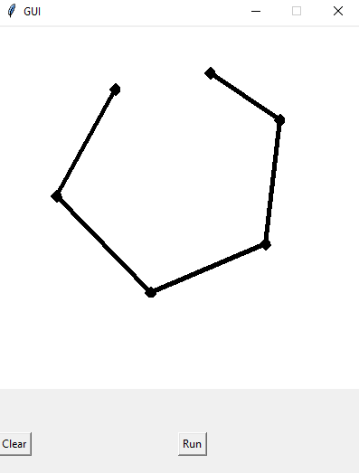
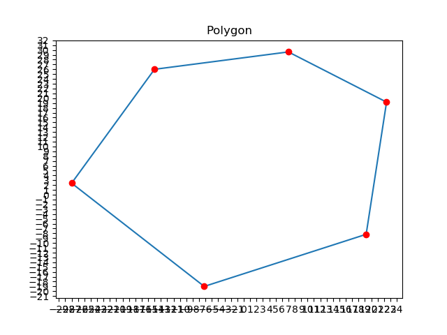
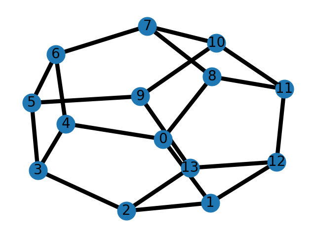

# Flip-Graph

Let $P$ be a polygon embedded in the plane, a [flip graph](https://en.wikipedia.org/wiki/Flip_graph) is a simple undirected graph whose vertex set is the set of all possible triangulations of $P$, and two triangulations are related by an edge if they can changed into one another by a "flip".<br />

This repository contains some of the codes we wrote for implementing Flip Graphs and calculating its graph invariants. For a more detailed introduction to what we did, please see my [presentation](presentation.pdf) at DIMACS's [Workshop on Modern Techniques in Graph Algorithms](https://sites.google.com/view/dimacswmtga).

This project was motivated by a question from Professor [Richard Schwartz](https://www.math.brown.edu/reschwar/). We thank him for his helpful guidance and conversations over this topic.

## Code

The folder **code** contains relevant code used in this project:
- **connectivity.py** produces the [graph](figures/plot.png) measuring the algebraic connectivity of the flip graph of convex $n$-gons.
- **flip_graph.py** contains the main algorithm for computing the flip graph of a polygon.
- **gui.py** lets the user draw a polygon and produces the flip graph of that. It also produces two files **input.txt** and **output.txt** that records the input polygon and the output graph.
- **handle_sql.py** contains some code that stores flip graphs into a SQL database.
- **polygon.py** contains the data structure implementation of a polygon and relevant helper functions.
- **visualize_polygon.py** visualizes a given polygon file. The file specification for a polygon of n vertices is as follows:
```
n
<x coordinate of vertex 1> <y coordinate of vertex 1>
...
<x coordinate of vertex n> <y coordinate of vertex n>
```

## Example

The following examples shows the flip graph of a convex hexagon computed using the GUI:<br />

1. The GUI input:<br/>


2. The convex hexagon shown:<br/>


3. The flip graph of the hexagon:<br/>


## How to Run
To install dependencies (note this program was made in Python 3.7.3)
```
pip install -r requirements.txt
```

To run the GUI
```
cd code
python gui.py
```

To run tests
```
cd tests
pytest
```